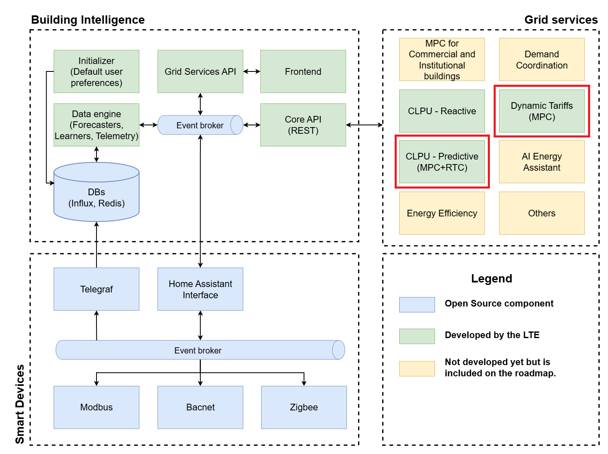

# Predictive Control

[](LICENSE.md)
[](CONTRIBUTING.md)

This repository contains the `predictive_control` Python package, which implements a robust and flexible hybrid control strategy combining Model Predictive Control (MPC) and Real-Time Control (RTC). Designed for intelligent energy management in highly electrified residential homes, this package optimizes energy consumption while ensuring strict adherence to grid limits and user preferences.

## System Architecture

This package is a key component within a larger **Building Intelligence** ecosystem, as illustrated in the architecture diagram below. It is designed to run as a service that consumes data from the central `Core API` of the Building Intelligence platform.



The diagram shows three primary layers:
1.  **Smart Devices:** The source of data from various building assets (e.g., HVAC, EV chargers) using protocols like Modbus and Bacnet.
2.  **Building Intelligence Platform:** The core infrastructure (a separate software repository) that gathers, stores, and processes data, making it available via a `Core API`.
3.  **Grid Services:** A set of applications that consume the API data to provide value-added services.

The `predictive_control` package provides the implementation for the grid services highlighted in red: **CLPU - Predictive (MPC+RTC)** and **Dynamic Tariffs (MPC)**. If you want more information about the main platform, you can visit its [**Documentation**](https://hq-opensource.github.io/building-intelligence/) or [**GitHub Repository**](https://github.com/hq-opensource/building-intelligence).

---

## Key Features

*   **Hybrid Control Strategy (MPC + RTC):** Proactively plans energy usage with MPC and provides immediate, reactive adjustments with RTC to handle unforeseen consumption spikes.
*   **Flexible Device Integration:** Offers a standardized `DeviceMPC` interface for seamless integration of various controllable devices (e.g., HVAC, water heaters, electric vehicles, batteries).
*   **User-Centric Optimization:** Balances energy cost minimization with occupant comfort by incorporating dynamic pricing and thermal models.

---

## Getting Started

### Prerequisites

*   [Python 3.11+](https://www.python.org/downloads/)
*   [Poetry](https://python-poetry.org/docs/#installation) for dependency management.
*   [Docker](https://docs.docker.com/get-docker/) for containerized execution.

### Installation

1.  **Clone the repository:**
    ```bash
    git clone https://github.com/hq-opensource/predictive-control.git
    cd predictive-control
    ```

2.  **Install dependencies using Poetry:**
    This command will create a virtual environment and install all the necessary packages defined in `pyproject.toml`.
    ```bash
    poetry install
    ```

---

## Usage

#### Running with Docker

The easiest way to run the application is by using the provided Docker container.

1.  **Build the Docker image:**
    ```bash
    docker build -t predictive-control .
    ```

2.  **Run the Docker container:**
    ```bash
    docker run predictive-control
    ```

#### Running with Poetry

You can also run the application directly using the virtual environment managed by Poetry.

1.  **Activate the virtual environment:**
    ```bash
    poetry shell
    ```

2.  **Run the application:**
    ```bash
    python -m src.cold_pickup_mpc.app
    ```

---

## Contributing
See how to contribute to this project [here](CONTRIBUTING.md).

## License
See the license for this project [here](LICENSE.md).